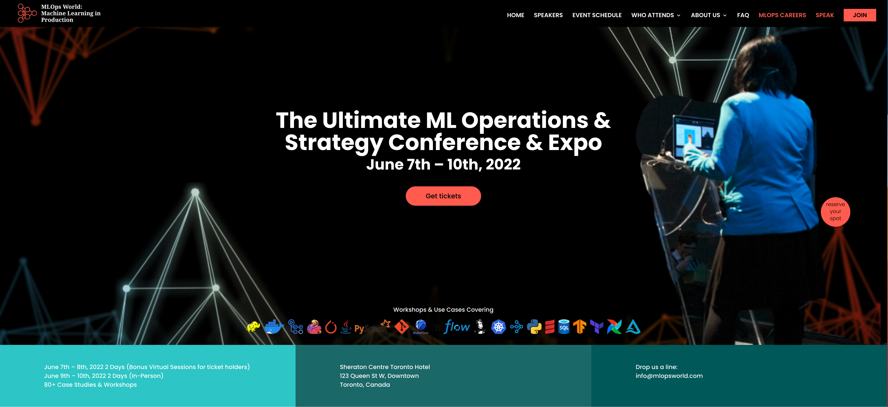

# Introduction to Model Deployment with Ray Serve

Welcome to the tutorial at MLOps World 2022 in Toronto!

This is a two-part introductory and 👩 hands-on 💻 guided tutorial. Part one covers a 👩 hands-on 💻 coding tour through the Ray core APIs, 
which provide powerful yet easy-to-use design patterns (tasks and actors) for implementing distributed systems in Python. Building 
on the foundation of Ray Core APIs, part two of this tutorial focuses on Ray Serve concepts, what and why Ray Serve, 
scalable architecture, and model deployment patterns. 

Then, using code examples 👩‍💻 in Jupyter notebooks, we will take a coding tour of creating, exposing, and deploying models 
to Ray Serve using core deployment APIs.

And lastly, we will touch upon Ray Serve’s integration with model registries such as MLflow, walk through an end-to-end example, 
and discuss and show Ray Serve’s integration with FastAPI.

Key takeaways for students:
 * 👩‍💻 Code Ray Core APIs to convert Python function/classes into a distributed setting
 * 📖 Learn to use Ray Serve APIs to create, expose, and deploy models with Ray Server APIs
 * ☑️ Access and call deployment endpoints in Ray Serve via Python or HTTP
 * ⚙️ Configure compute resources and replicas to scale models in production
 * 📖 Learn about Ray Serve integrations with MLflow and FastAPI

### Outline for the Tutorial Lessons 📖

| Notebooks| **Module 1**|**Ray Core API Patterns for Tasks, Objects, and Actors** |
|:---------| :-----------|:----------------------------------------------------------|
| 00  | [Ray Tutorial Overview](ex_00_tutorial_overview.ipynb) | Overview of this tutorial. |
| 01  | [Ray Remote Functions ](ex_01_remote_funcs.ipynb) |The Remote Function as Stateless Tasks Pattern. |
| 02  | [Ray Remote Objects](ex_02_remote_objs.ipynb) |The Remote Objects as Futures Pattern. |
| 03  | [Ray Remote Classes](ex_03_remote_classes.ipynb) |The Remote Classes as Stateful Actors Pattern |
|     |**Module 2**|**Introduction to Ray Serve and model deployments** |
| 04  | [Ray Serve Model Serving Challenges](ex_04_model_serving_challenges.ipynb) | What are model serving challenges |
| 05  | [Ray Serve Accessing Deployments]( ex_05_ray_serve_create_and_access_deployments.ipynb) | Create, deploy and access Ray Serve deployments |
| 06  | [Ray Serve Model Composition](ex_06_model_composition.ipynb) | Model composition model deployment pattern. A sentiment analysis model using HuggingFace 🤗 transformers|
|     | **Extras** | **Ray Serve Integration and end-to-end example** |
| 07  | [Ray Serve and MLflow Integration](ex_07_ray_serve_mlflow.ipynb) | A simple model trained, logged to MLflow registry and served from in a Ray Serve deployment. |
| 08  | [Ray Serve and FastAPI Integration](ex_08_ray_serve_fastapi.ipynb) | A simple XGBoost model trained, deployed, and accesses via FastAPI endpoints |
| 09  | [Ray Serve End to End Example](ex_09_ray_serve_end_to_end.ipynb) | An end-to-end example using XGBoost, Tune, and Ray Serve for classification model using diabetes dataset |

### 🧑‍🎓Prerequisite knowledge ###

Some prior experience with Python and Jupyter notebooks will be helpful, but we'll explain most details as we go if you 
haven't used notebooks before. Knowledge of basic machine learning concepts, including hyperparameters, model serving, 
and principles of distributed computing is helpful, but not required.

All exercises are optional and can be done on your laptop, preferably running a Linux or macOS, using all its cores. 
Because you won’t have access to Ray clusters, we have to run Ray locally and parallelize all your tasks on all your cores.

Python 3.7+ is required on your laptop, and some minimal installation of quick python packages using conda and pip.

### 👩‍🏫 Instructions to get started

We assume that you have a `conda` installed.

 1. `conda create -n ray-core-serve-tutorial python=3.8`
 2. `conda activate ray-core-serve-tutorial`
 3. `git clone git@github.com:dmatrix/ray-core-serve-tutorial-mlops.git`
 4. `cd` to <cloned_dir>
 5. `python3 -m pip install -r requirements.txt`
 6. `python3 -m ipykernel install`
 7. `conda install jupyterlab`
 8. `jupyter lab`
 
 If you are using **Apple M1 laptop** 🍎 run the following additional command:
 
 9. `conda install grpcio`
 
Let's have 😜 fun with Ray @ MLOps World 2022!

Thank you 🙏,

Jules & Archit
